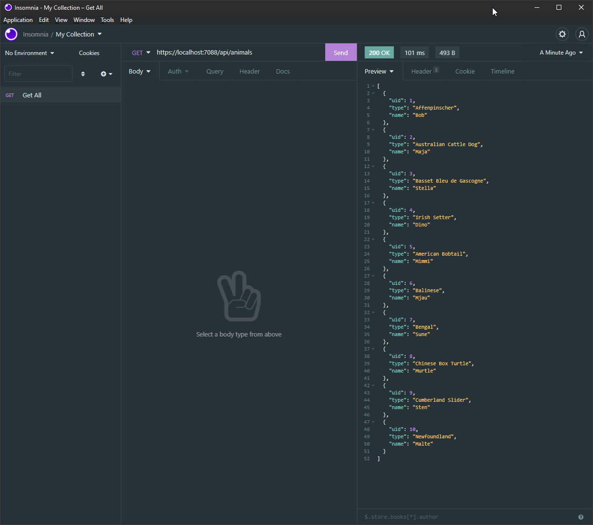
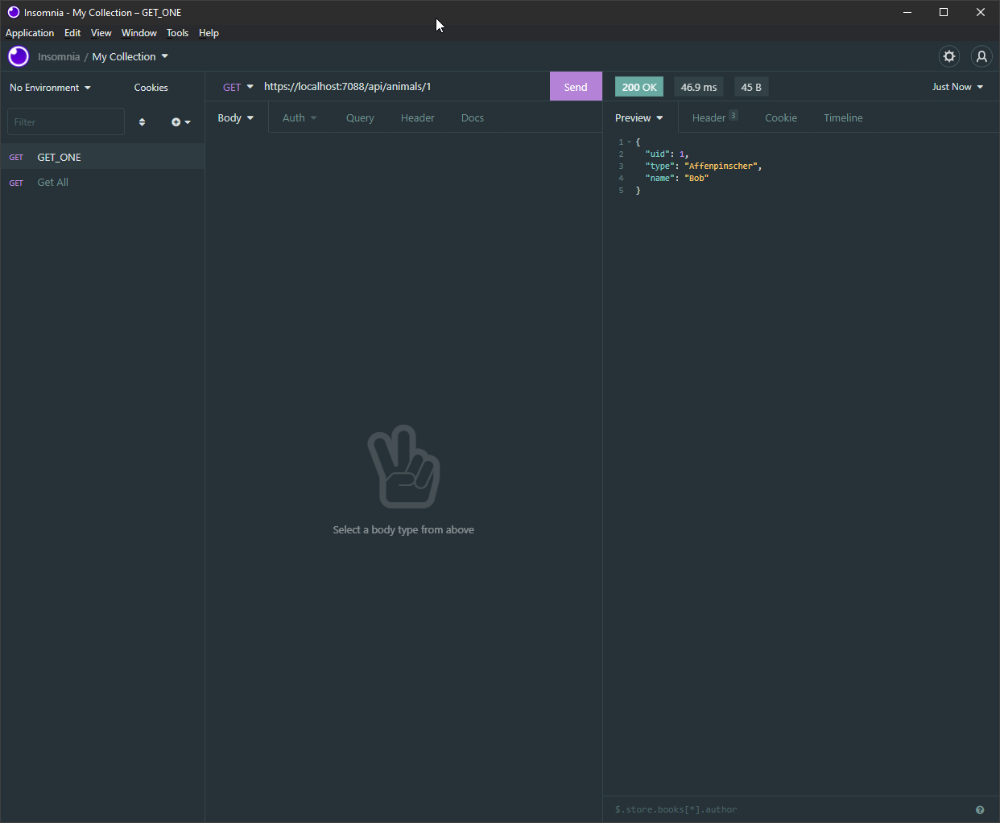
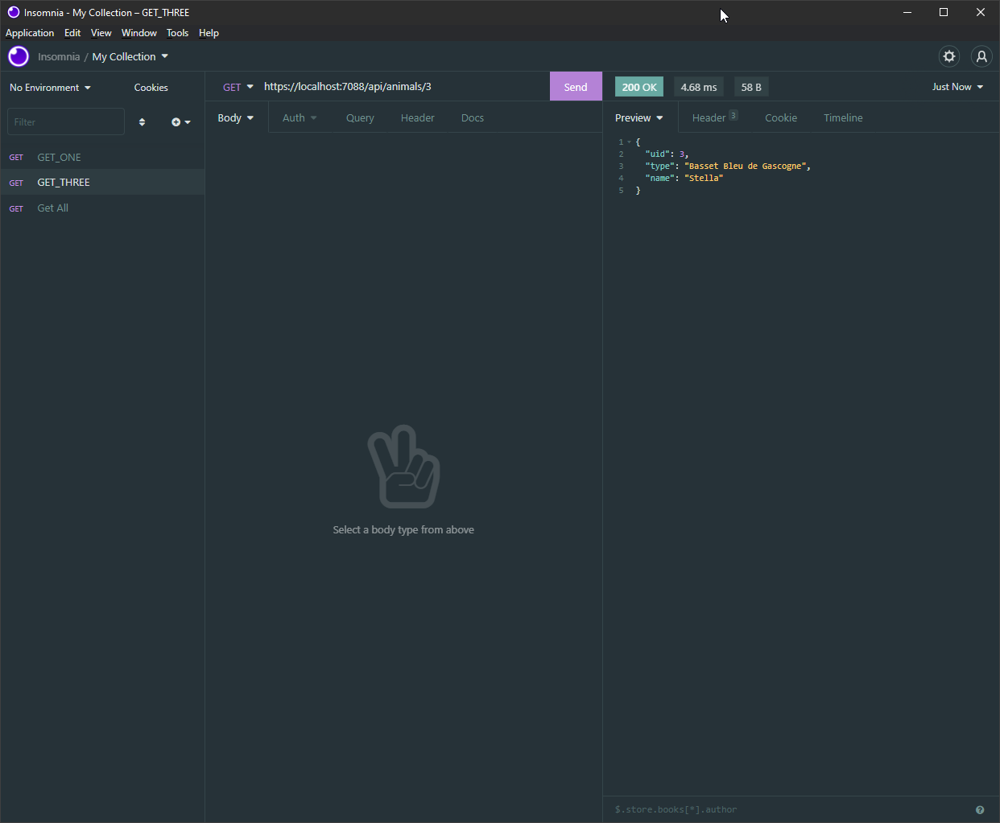
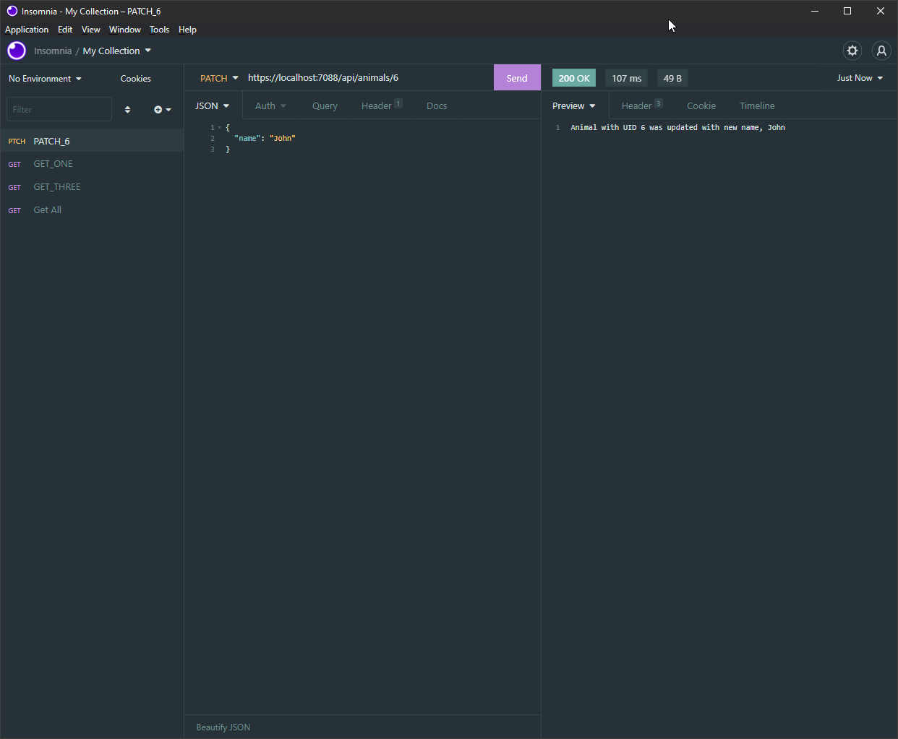
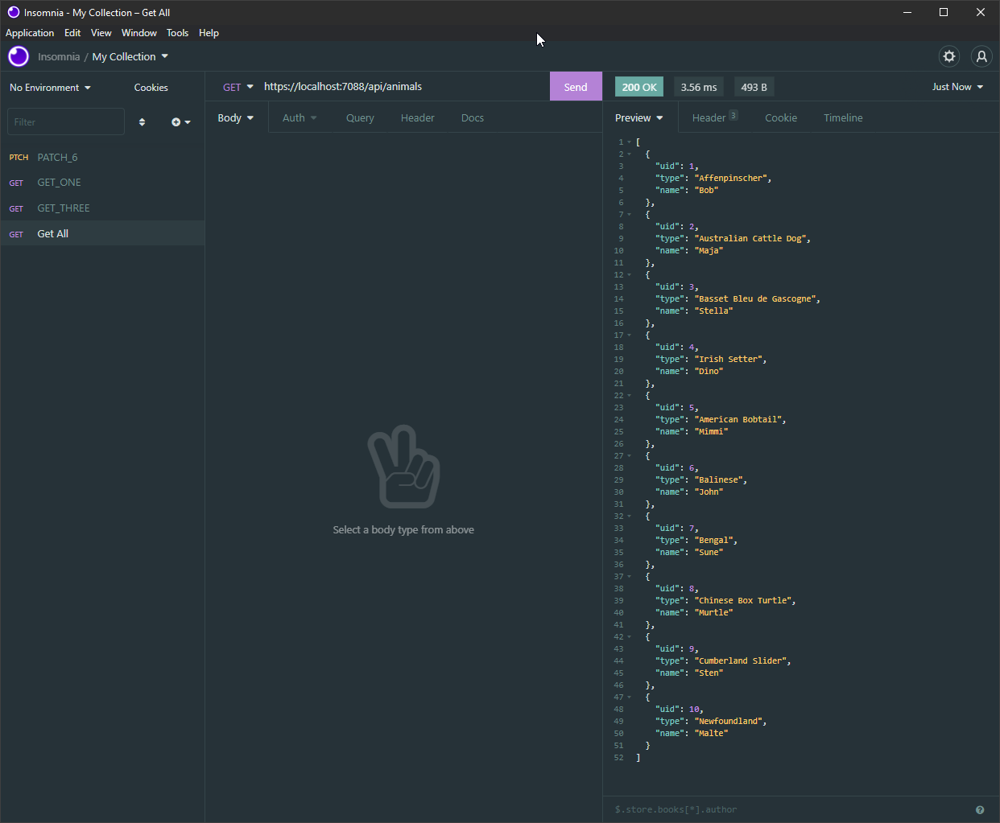
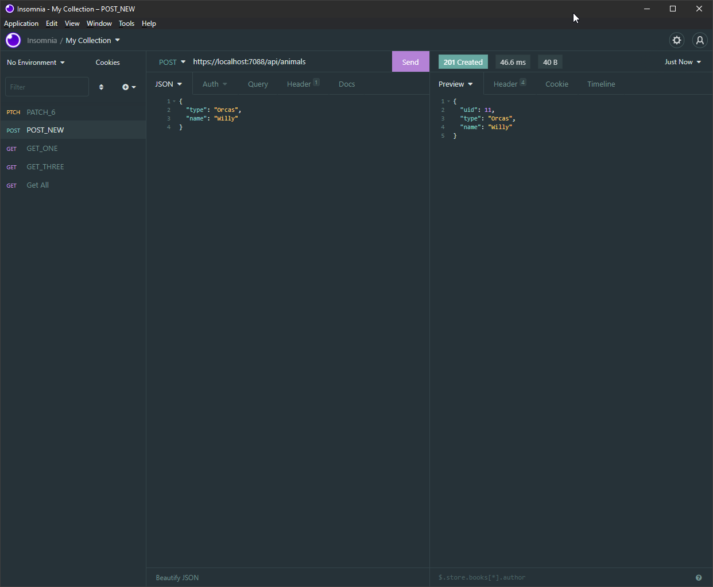
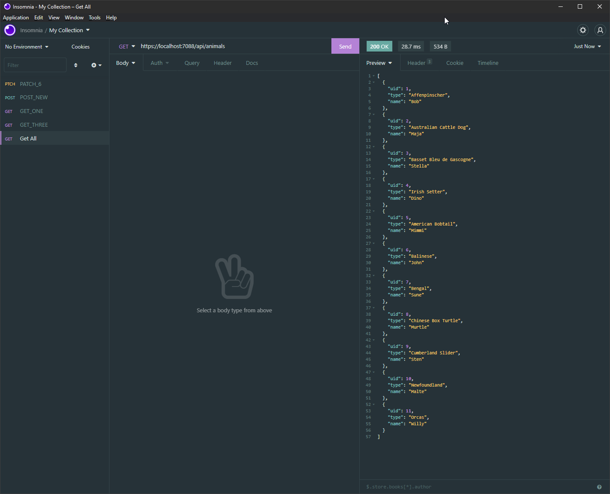
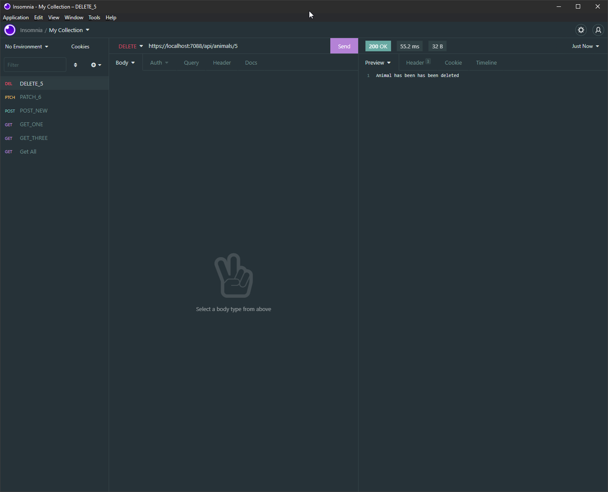
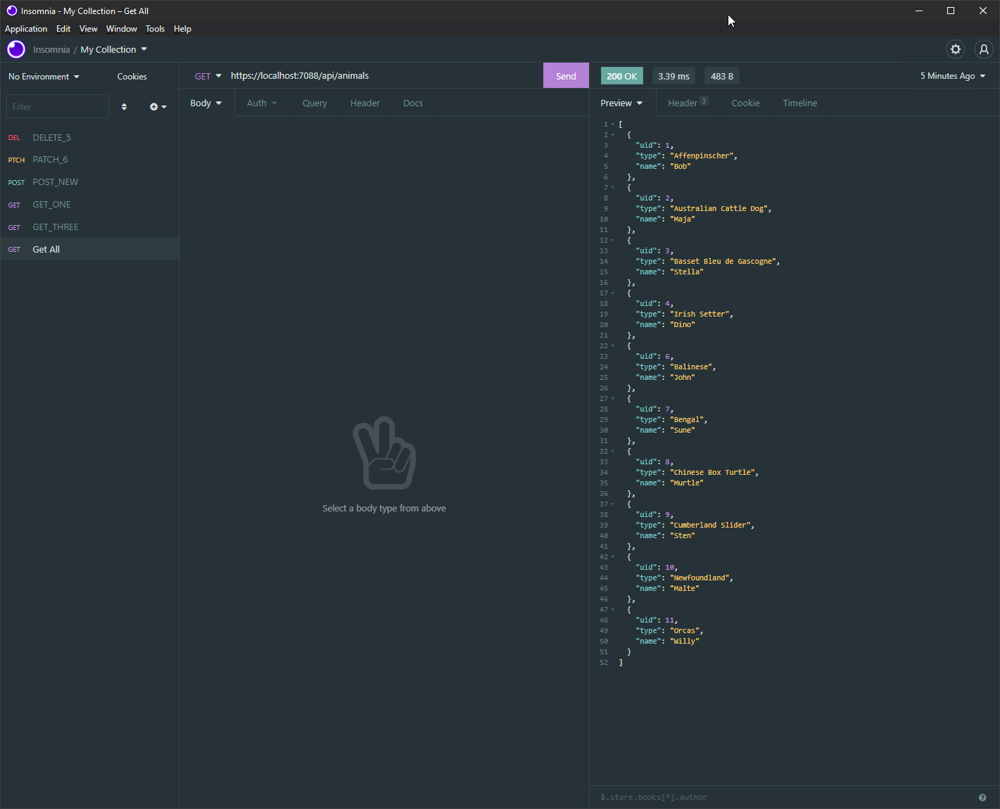

# ITHS_Backend_C_Lab_1

A simple C# Web Rest API - Animals

Joakim Eberholst only

## Requests
* GET /animals Lista samtliga djur.

_Get all_

______________

#### GET /animals/{id} Returnera ett djur beroende på vilket id som skickas in.

_Get uid 1_

_Get uid 3_

______________

#### ~~PUT~~ PATCH/animals/{id} Uppdatera namnet på en djur med rätt id

_Patch 6_

_Get all_

______________

#### POST /animals Skapar ett nytt djur
_Post new_

_Get all_

______________

#### DELETE /animals/{id} Radera ett djur beroende på vilket id som skickas in.

_Get all_

______________

